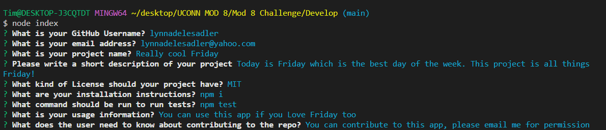

# Sadler-s-Professional-README-Generator

## Description
When creating an open source project on GitHub, it’s important to have a high-quality README for the app. This should include what the app is for, how to use the app, how to install it, how to report issues, and how to make contributions—this last part increases the likelihood that other developers will contribute to the success of the project.
You can quickly and easily create a README file by using a command-line application to generate one. This allows the project creator to devote more time to working on the project. 

## Access

The URL of the GitHub repository ...

https://github.com/lynnadelesadler/Sadler-s-Professional-README-Generator

The URL for Screencastify Video Demo on Google Drive...

https://drive.google.com/file/d/1P3mj2I4wrWqxBUwPY3IrdV6nl6CamjKq/view

## Visuals

<!-- Provide the visuals for full display and phone display -->
This is how Sadler-s-Professional-README-Generator will look when the application is be invoked by using the 'node index.js' command in the terminal...

## Usage
- To create a high-quality README for your app..

  - Initialize your repository with a `package.json` file by running `npm init -y`.

  - Install inquirer version 8.2.4 and add it to your list of dependencies by running `npm i inquirer@8.2.4`

- The application will be invoked by using the following command:
    - node index.js

- The following will be prompted to the user..
       
    - What is your GitHub Username?
    - What is your email address?
    - What is your project name?
    - Please write a short description of your project
    - What kind of License should your project have?
    - What are your installation instructions?
    - What command should be run to run tests?
    - What is your usage information?
    - What does the user need to know about contributing to the repo?

- Once all prompts are answered you will see a message in the console log... 

- Navigate to your README to see the newly generated file!

_Here you will see a demonstration on Sadler-s-Professional-README-Generator works._

## Support
For help with this webpage please contact
|Name | Email |
|-----------|---------------------------|
|Lynn Sadler| lynnadelesadler@yahoo.com |

## Roadmap
Check back to this page as enhancements could be made for usability and optimized display.

## Authors and acknowledgment
Acknowledgment to npm inquirer version 8.2.4 as this application runs off of.  

Startercode credit to © 2022 Trilogy Education Services, LLC, a 2U, Inc. brand. 

Primary credit to be given to Lynn Sadler for building the application prompts and success of the application.

Acknowledgement to Uconn Full Stack Web Developer Bootcamp, Teachers and Teacher assistants for supporting me on my developer journey!

## License
N/A